- **Execution Time:** 1hr - 2hrs
- **Difficulty:** Easy
- **Cost:** $0 - $254

This post is about how I built a heart rate monitoring system for my home office using balena technology. Check out my code here <https://github.com/rhampt/balena-health> to follow along.

_Are you looking to decrease your stress and improve your mental well-being? Follow along with my DIY guide for monitoring your heart rate during the work day!_

# Motivation

We can all agree that mental health is extremely important. The goal of BalenaHealth is to create DIY solutions for improving your mental well-being. In this initial version, the project is used for monitoring your heart rate while working to gauge stress levels and decrease them over time.

This solution allows you to monitor real-time and historical heart rate data while working. It will continually measure and display your heart rate on the locally connected screen. The wireless heart rate sensor communicates real-time to a Raspberry Pi via Bluetooth. An InfluxDB time series database is kept on the device and your historical heart rate data is presented by Grafana via a URL. This will help you spot trends and determine if this method of reducing stress actually works.

Your desktop RPi application will update the attached E-Ink display every 30 seconds (configurable) with your latest heart rate. If your heart rate reaches a configurable threshold, a sunset image will show on the E-Ink display, reminding you to take some deep breaths. You can also configure a small buzzing sound as an audio cue. This reminder to breathe will hopefully lower your heart rate and reduce your stress levels.

# Contents

- [Motivation](#motivation)
- [Contents](#contents)
- [Project Highlights](#project-highlights)
- [Getting Started](#getting-started)
  - [Supported Devices](#supported-devices)
  - [Equipment](#equipment)
- [Walkthrough](#walkthrough)
  - [Hardware Configuration](#hardware-configuration)
    - [Fan Pins](#fan-pins)
    - [Buzzer Pins](#buzzer-pins)
    - [E-Ink Pins](#e-ink-pins)
  - [Deployment](#deployment)
    - [The Advanced Way](#the-advanced-way)
    - [The Easier Way](#the-easier-way)
  - [First Device Boot](#first-device-boot)
  - [System Overview](#system-overview)
  - [Services and Configurations](#services-and-configurations)
    - [`data-collector` service](#data-collector-service)
    - [`eink` service](#eink-service)
    - [`mqtt` service](#mqtt-service)
    - [`connector` service](#connector-service)
    - [`influxdb` service](#influxdb-service)
    - [`dashboard` service](#dashboard-service)
- [Next Steps](#next-steps)

# Project Highlights

- Supports any Low-Energy Bluetooth (BLE) heart rate monitor that conforms to Bluetooth SIG's [Service Schema](https://www.bluetooth.com/wp-content/uploads/Sitecore-Media-Library/Gatt/Xml/Services/org.bluetooth.service.heart_rate.xml).
- Specifically tested with the [Polar H10](https://www.polar.com/us-en/products/accessories/h10_heart_rate_sensor) BLE heart rate device.
- Include a time-series graph (InfluxDB -> Grafana) to see heart rate over time
- Shows heart rate on an attached E-Ink display
- Configured visual and audio indicator when you heart rate exceeds a certain threshold
- Simulation mode for those wishing to test without purchasing hardware!

# Getting Started

## Supported Devices

BalenaHealth has been tested on the following devices:

| Device Type      | Status |
| ---------------- | ------ |
| Raspberry Pi 3b+ | ✔      |
| Raspberry Pi 4   | ✔      |

It may support others!

## Equipment

- Single-board computer: [Raspberry Pi 4 Model B](https://www.amazon.com/Raspberry-Model-2019-Quad-Bluetooth/dp/B07TC2BK1X/) ($95)
- SD card: [SanDisk Extreme Pro](https://www.amazon.com/SanDisk-Extreme-UHS-I-128GB-Adapter/dp/B07G3GMRYF/) ($15)
- Case (with fan, heatsink, and power supply): [Miuzei brand](https://www.amazon.com/Miuzei-Raspberry-Cooling-Aluminum-Heatsinks/dp/B07TTN1M7G/) ($15)
- Heart rate sensor: [Polar H10](https://www.polar.com/us-en/products/accessories/h10_heart_rate_sensor) ($90)
- E-Ink screen: [Waveshare](https://www.amazon.com/gp/product/B075FQKSZ9/) ($27)
- Active Buzzer Module: [Ximimark](https://www.amazon.com/Ximimark-Active-Buzzer-Module-arduino/dp/B07TVN22LP) ($6)
- Jumper Wires: [HiLetgo](https://www.amazon.com/HiLetgo-Breadboard-Prototype-Assortment-Raspberry/dp/B077X7MKHN) ($6)

**Note:** You can deploy this project using simulation mode without having the heart rate sensor, E-Ink screen, or buzzer module attached. The case is optional as well.

Total with all equipment: $254

Total with only essential equipment: $125

# Walkthrough

## Hardware Configuration

**Note:** Feel free to skip this section if you are running the application in `SIMULATION_MODE=true` and don't have hardware.

Here are two images of the overall system in operation, one where my bpm is "normal" and the other after a triggering event.

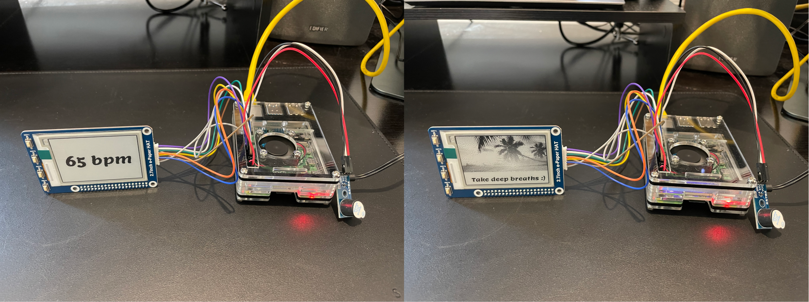

**Note**: A helpful website for getting info on the BCM and pin mappings for the Raspberry Pi is [pinout.xyz](https://pinout.xyz/). All pin names mentioned are for the BCM mappings for the Raspberry Pi 4 as shown in this image:

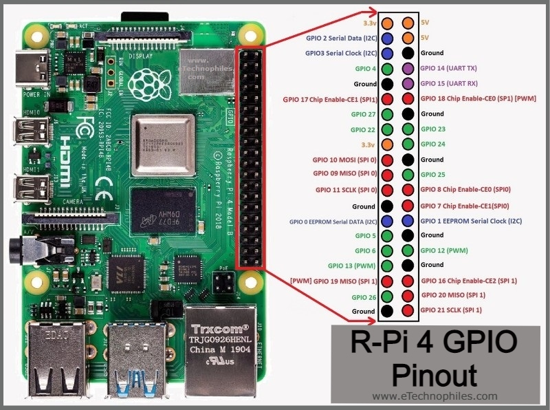

### Fan Pins

My fan (mounted to the case) is using a 5V (red) and a Ground (black) pin. Any will do.

### Buzzer Pins

My buzzer is using a 3.3V (red) and a Ground (black) pin. The white jumper wire connects from the I/O pin on the buzzer board to the GPIO 5 pin on the RPi.

### E-Ink Pins

I followed along with the the [Waveshare DIY Projects Guide](https://diyprojects.io/test-waveshare-epaper-eink-2-7-spi-screen-raspberry-pi-python/) to wire the E-Ink display to the RPi. Since I have a case mounted, I couldn't use the nice header strip that would have mounted it directly to the RPi. Instead, I configured the various SPI pins to those on the RPi. In order for me to handle the `Key 1` press event from the display, I configured one of the header pins to GPIO Pin 16 on the RPi.

| E-Ink Pin | Wire Color | RPi Pin |
| --------- | ---------- | ------- |
| BUSY      | purple     | GPIO 24 |
| RST       | white      | GPIO 17 |
| DC        | green      | GPIO 25 |
| CS        | orange     | GPIO 8  |
| CLK       | yellow     | GPIO 11 |
| DIN       | blue       | GPIO 10 |
| GND       | brown      | GND     |
| VCC       | gray       | 3.3V    |

Here is an image of my E-Ink screen wiring followed by some close ups of the RPi wiring.

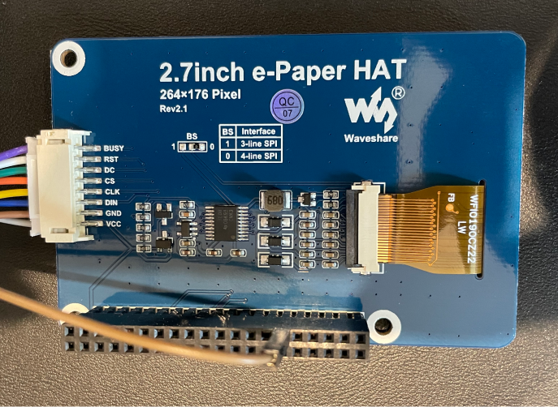

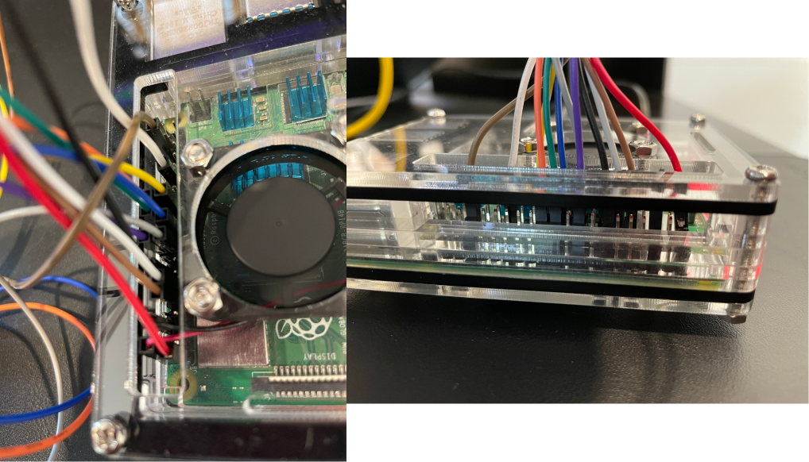

## Deployment

Alright, now that you you've got your hardware configured, it's time to look at deploying the software. I'll get into the _how_ and various configurations after you get the software deployed. There are two options.

### The Advanced Way

If you are already a balena user it might be better for you to use this way. You can clone [the project](https://github.com/rhampt/balena-health/) from GitHub and use the [balena CLI](https://github.com/balena-io/balena-cli) to push the application to your device. This is the best option if you want to tinker with the project and have full control.

The [Getting Started Guide](https://www.balena.io/docs/learn/getting-started/raspberrypi3/python/) covers this option. After you've created the application and pushed the code using the CLI, follow the steps below.

### The Easier Way

[Sign up](https://dashboard.balena-cloud.com/signup) for a free balenaCloud account. Your first ten devices are free and full-featured! Then use the button below to create and deploy the application:

[](https://dashboard.balena-cloud.com/deploy?repoUrl=https://github.com/rhampt/balena-health)

You should see a model popup that looks similar to this:

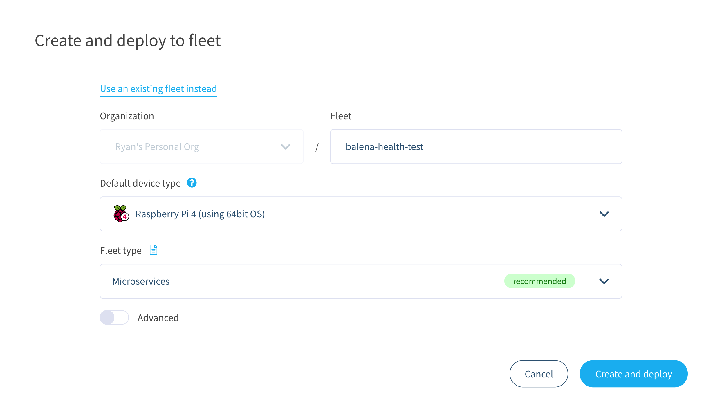

You can name the application whatever you'd like. Push `Create and deploy` and you'll see a new application with that name show up in the dashboard.

**Note:** If you don't have the hardware but still want to test the application, toggle `advanced` and set `SIMULATION_MODE` to `true`. If you have a heart rate sensor, make sure to set this value to `false` so that the proper code is used to poll for heart rate. Also, set the `H10_MAC_ADDR` variable to your heart rate devices' mac address. Check out the [Services and Configurations](#services-and-configurations) below for details on determining your sensors' mac address and other configuration options.

Once your application has been created, you can set up and add a device within that application by clicking the `Add device` button. When you add a device, you specify your device type, and if you are connecting to a wireless network you can set your WiFI SSID and passphrase here too.

**Note:** I have used a Raspberry Pi 4 in the image below but be sure to select the correct device type for the device you are using.

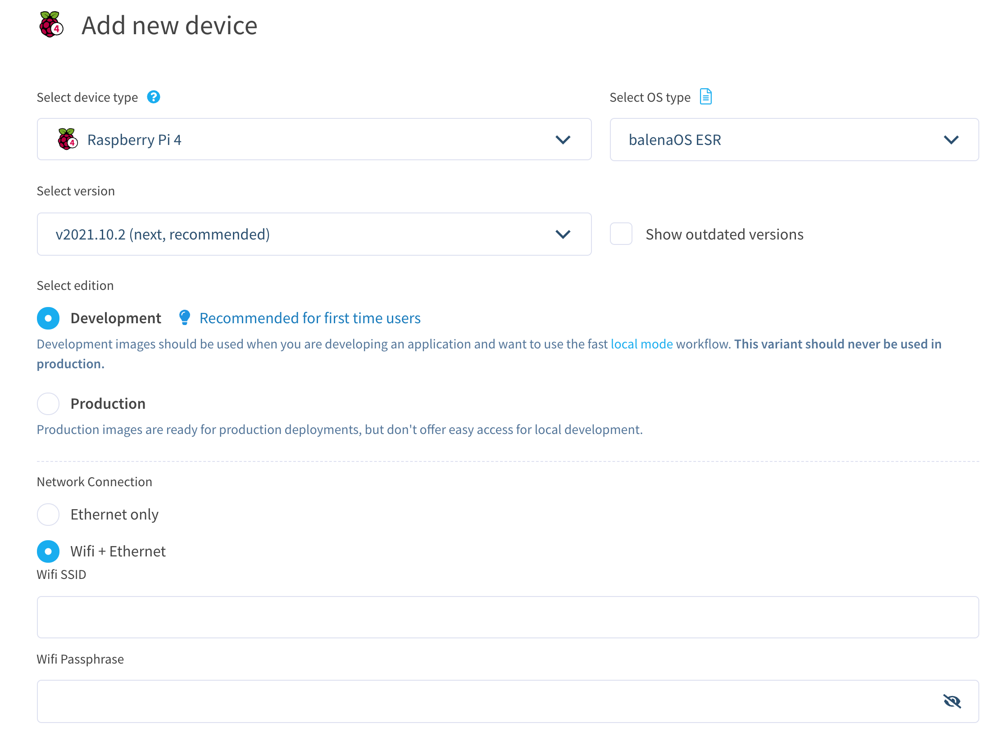

Notice that I selected the Development edition. This allowed me to push to the device locally, speeding up my development significantly.

This process creates a customized image configured for your application and device type and includes your network settings if you specified them. Once the OS image has been downloaded, it’s time to flash your SD card. You should use [balenaEtcher](https://www.balena.io/etcher/) for this.

Once the flashing process has completed, insert your SD card into the Raspberry Pi and connect the power supply.


## First Device Boot

When the device boots for the first time, it connects to the balenaCloud dashboard, after which you’ll be able to see it listed as `online`.

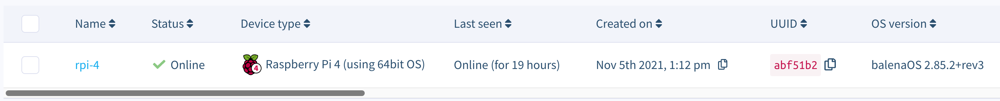

After a few minutes your device information screen in the dashboard should look something like the following image that shows the services running, one for each of the software services (deployed [Docker](https://www.docker.com/) containers). If not, check out our [troubleshooting guide](https://www.balena.io/docs/faq/troubleshooting/troubleshooting/) or head over to the [forums](https://forums.balena.io/) where we can help you out.

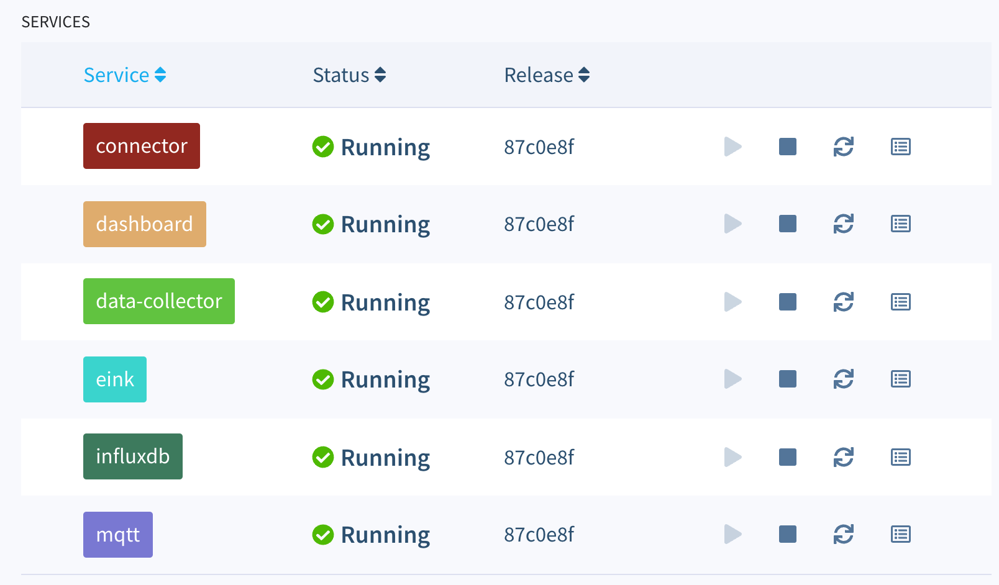

One of the great benefits of using a free balenaCloud account is that you’re able to use the Public Device URL feature.

Enable this toggle on your device and click the blue arrow to access the dashboard; you can share this link or bookmark it for use from your phone or another mobile device. As long as your balenaHealth device is online and working, you’ll be able to access your dashboard from anywhere!

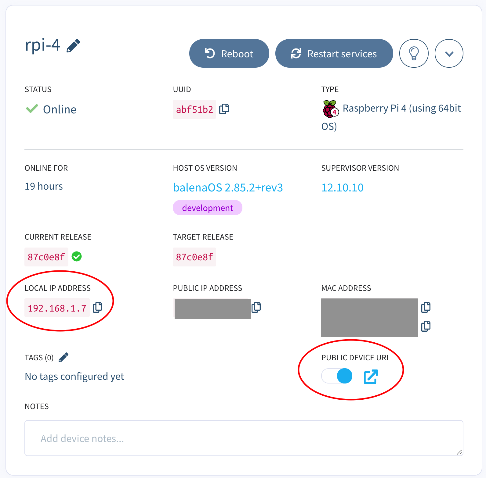

If you don’t want to enable the public device access, you can still view the dashboard from within your own local network by using the IP address value from the image above. Yours will be different, but if you enter http:// into a browser, you’ll still be able to access the dashboard as long as you’re on the same network as the device. For example, to access my device I would use <http://192.168.1.7>.

When you first open your dashboard, you should see the default page with a summary at the top and collapsed view for your bpm. Click on the arrow to the left of the `Bpm` to expand that section and see the historical data. Initially, you may want to change the time frame using the dropdown in the upper right from the default of “Last 12 hours” to something shorter so the graph isn’t squished to the right. Here I've just shown my own heart rate for the last 5 minutes.

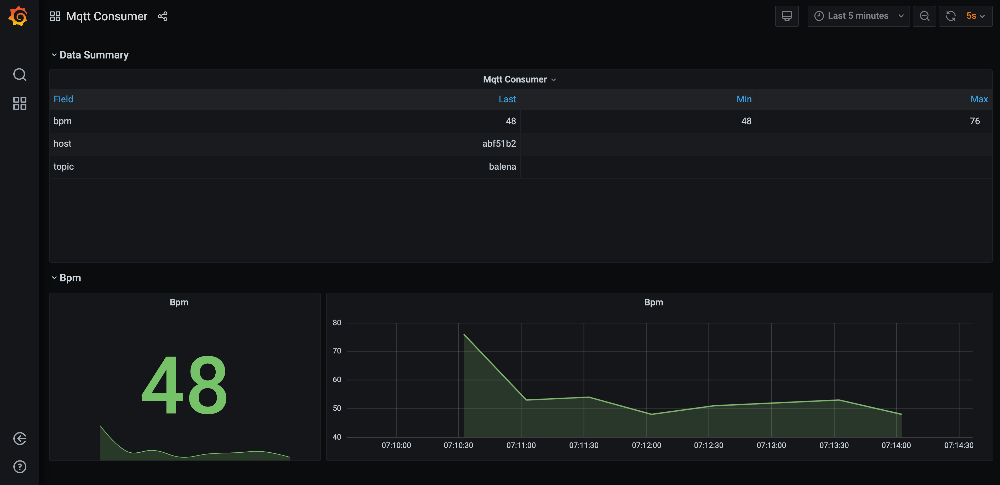

Because balenaHealth saves your dashboard data to a persistent volume, your changes will be saved even if you reboot or restart all of the containers on the device.

## System Overview

Alright, now that you've got your device deployed, let's take a look at how the whole system comes together. This section is also a useful reference for configuring your own environment and understanding the _how_ for balenaHealth.

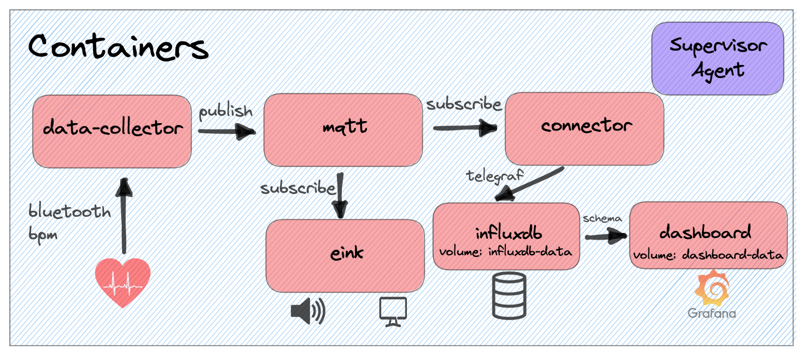

The system architecture image above shows the high level view of the containers deployed on the Raspberry Pi. To learn more about this operating system, head over to our page on [balenaOS](https://www.balena.io/os/). There are six user-space containers deployed as services via the docker-compose.yml file. These are described below.

## Services and Configurations

### `data-collector` service

This service runs a [Node](https://nodejs.org/en/) application that receives HR data over [BLE](https://en.wikipedia.org/wiki/Bluetooth_Low_Energy) and routes it to the [MQTT](https://mqtt.org/) broker. Let's take a look at the relevant section of the `docker-compose.yml` file.

```yml
services:
  data-collector:
    build: ./data-collector
    restart: always
    privileged: true
    network_mode: host
    environment:
      - SIMULATION_MODE=false # set to true if you have no HW
      - H10_MAC_ADDR=E8:78:8D:A0:03:CA # see README.md
      - BLUETOOTH_RETRY=30 # integer number of seconds
      - MQTT_PUB_INTERVAL=30 # integer number of seconds
```

As you can see, this service builds the local `data-collector`. Looking at that project's `Dockerfile.template` the base build image is `balenalib/%%BALENA_MACHINE_NAME%%-ubuntu-node:14.18.1-bionic-build` where %%BALENA_MACHINE_NAME%% will resolve to your device (ex: raspberrypi4-64). After building the application, I use a different container for runtime, `balenalib/%%BALENA_MACHINE_NAME%%-alpine-node:14.18.1-run`. This means that the container deployed will have a slimmed down container size. Using `install_packages`, I made sure to install the required BLE bluetooth package `bluez-deprecated`. The Docker `CMD` executed is `start.sh` which just executes `npm run start` (or `npm run start-sim` if in simulation mode) before idling.

Check out `index.js` to see how I spawn the `gatttool` application in order to connect to the heart rate monitor via bluetooth low-energy (BLE).

There are four configurable environment variables:

1. `SIMULATION_MODE` is a flag for selecting which file to execute. If it's not set or set to false, I'll assume you have the hardware and it's hooked up. If it's set to true, I'll run a simulation of the hardware instead.
2. `H10_MAC_ADDR` is the Mac Address of your sensor. You can figure out your sensor's Mac Address by starting the service on idle and running `bluetoothctl | grep Polar` or `hcitool lescan | grep Polar`.
3. `BLUETOOTH_RETRY` is the number of seconds to wait to try to reconnect to your sensor via the gatttool application.
4. `MQTT_PUB_INTERVAL` is the frequency in seconds that you want to send your heart rate (in BPM). Too often, and the e-ink display can't keep up with the changes and you will see some strange symbols. Not often enough and you won't get an accurate account of your heart rate.

### `eink` service

This is a Python app that receives live heart rate from the MQTT broker and outputs it to the E-Ink display attached to your Raspberry Pi. Let's take a look at the relevant section of the `docker-compose.yml` file.

```yml
services:
  eink:
    build: ./eink
    restart: always
    privileged: true
    network_mode: host
    environment:
      - SIMULATION_MODE=false # set to true if you have no HW
      - BPM_THRESHOLD=80 # integer bpm threshold
      - BUZZER_ALARM=true # set to false if you don't want the buzzer to sound
      - HEARTBEAT_INTERVAL=60 # integer number of seconds
      - MQTT_RETRY_PERIOD=30 # integer number of seconds
```

As you can see, this service builds the local `eink`. Looking at that project's `Dockerfile.template` the base image is `balenalib/%%BALENA_MACHINE_NAME%%-ubuntu-python:3.7-bionic-run`. I used the `run` variant to slim down the container size. Using `install_packages`, I made sure to install the relevant packages for my application. I used `pip` to install a few more Python packages. The Docker `CMD` executed is `start.sh` which just executes `npm run start` (or `npm run start-sim` if in simulation mode) before idling.

Check out `eink.py` to see how I receive MQTT messages and route them to the display in real time.

There are five configurable environment variables:

1. `SIMULATION_MODE` is a flag for selecting which file to execute. If it's not set or set to false, I'll assume you have the hardware and it's hooked up. If it's set to true, I'll run a simulation of the hardware instead.
2. `BPM_THRESHOLD` is the configured threshold to trigger the image and buzzing alarm as a reminder to breathe. Everyone has different base heart rate levels, so make sure to set it sufficiently high so as not to trigger during periods of non-stress.
3. `BUZZER_ALARM` is a flag that enables or disables the buzzer alarm that sounds when the threshold is reached. The default is set to true.
4. `HEARTBEAT_INTERVAL` is the number of seconds to elapsed with no heart rate data before clearing the screen. With E-ink displays it's import to not leave the screen with any black pixels on it for too long, or else they could get burned in! This helps make sure that when you walk away or there is a disconnect event, the screen repeatedly clears itself.
5. `MQTT_RETRY_PERIOD` is the number of seconds that must elapse before trying to connect to the MQTT broker again. This is only used if a connection dies or is failed to be established in the first place (ex: perhaps the `mqtt` service is slower to spin up).

### `mqtt` service

This service runs the Docker Hub base image for [eclipse-mosquitto:1.6.15](https://hub.docker.com/layers/eclipse-mosquitto/library/eclipse-mosquitto/1.6.15/images/sha256-521126b3e99113d1479c1f58fb0b62e735899cc5aa820745394dc97b7700e3c3?context=explore). The Mosquitto broker is a lightweight open source message broker for MQTT that `connector`, `eink`, and `data-collector` all rely on to route heart rate data around the system. Learn more about the Mosquitto MQTT Broker [here](http://www.steves-internet-guide.com/mosquitto-broker/).

### `connector` service

This service intelligently connects data sources with data sinks in block-based balena applications. The `connector` block is a docker image that runs telegraf and code to find other services running on the device, and intelligently connects them. For Balena-Health, `connector` will route MQTT messages from the `balena` topic to the `influxdb` service so that `dashboard` can display heart rate values.

Check out the [balenablocks/connector](https://github.com/balenablocks/connector) repo for more details.

### `influxdb` service

The `influxdb` service is used for building our historical heart rate database. It exposes the heart rate data that `connector` routes to the `dashboard` service. This service simply uses the [arm32v7/influxdb](https://hub.docker.com/r/arm32v7/influxdb/tags) image from Docker Hub. Find out more about influx [here](https://www.influxdata.com/)

### `dashboard` service

A customizable data visualization tool with automatically generated dashboards based on the discovered schema of an InfluxDB instance running on the same device. Here, I am using it to visualize heart rate readings over time.

This service will display a your historic heart rate measurements in a Grafana dashboard accessible via the device URL port 80. If you're deploying the project to balenaCloud, make sure to enable your device's Public URL to view this dashboard.

Check out the [balenablocks/dashboard](https://github.com/balenablocks/dashboard) repo for more details.

# Next Steps

Go ahead and explore! There are many future adaptations that could be made to expand balenaHealth's capabilities. A few I had in mind are:

- Image recognition for more data on stress level derived from time spent frowning vs smiling
- HIPAA compliant AWS cloud environment linkage. It could use the MQTT connector balenaBlock to connect a RPi to an AWS cloud environment. Through monitoring data trends in your AWS environment, you may spot fewer high-heart rate periods while working.

Please feel free to expand on balenaHealth and submit pull requests to the repo.

I hope you enjoyed this project as much as I enjoyed developing it!
