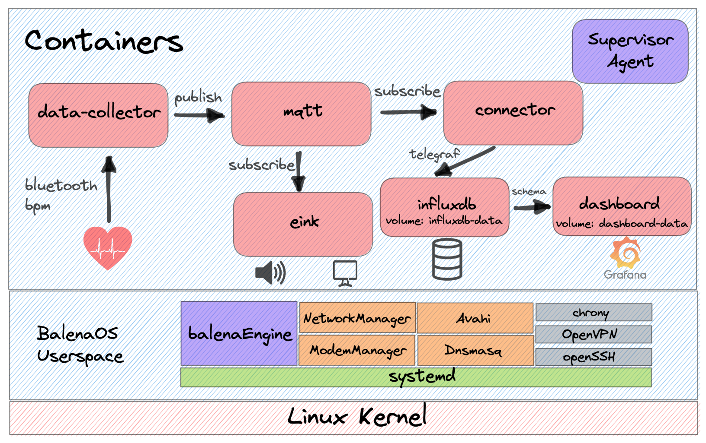

# BalenaHealth


This is a balenaHub project that allows users to monitor their heart rate in real time. Future enhancements will be to support health and well-being.

## Highlights

- Supports any Low-Energy Bluetooth (BLE) heart rate monitor that conforms to Bluetooth SIG's [Service Schema](https://www.bluetooth.com/wp-content/uploads/Sitecore-Media-Library/Gatt/Xml/Services/org.bluetooth.service.heart_rate.xml).
- Specifically tested with the [Polar H10](https://www.polar.com/us-en/products/accessories/h10_heart_rate_sensor) BLE heart rate device.
- Include a time-series graph (InfluxDB -> Grafana) to see heart rate over time
- Shows heart rate on an attached E-Ink display
- Configured visual and audio indicator when you heart rate exceeds a certain threshold

## Supported Devices

BalenaHealth has been tested on the following devices:

| Device Type      | Status |
| ---------------- | ------ |
| Raspberry Pi 3b+ | ✔      |
| Raspberry Pi 4   | ✔      |

## Motivation

We can all agree that mental health is extremely important. The goal of BalenaHealth is to create DIY solutions for improving your mental well-being. In this initial version, the project is used for monitoring your heart rate while working to gauge stress levels and decrease them over time.

This solution allows you to monitor real-time and historical heart rate data while working. It will continually measure and display your heart rate on the locally connected screen. The wireless heart rate sensor communicates real-time to a Raspberry Pi via Bluetooth. An InfluxDB time series database is kept on the device and your historical heart rate data is presented by Grafana via a URL. This will help you spot trends and determine if this method of reducing stress actually works.

Your desktop RPi application will update the attached E-Ink display every 30 seconds (configurable) with your latest heart rate. If your heart rate reaches a configurable threshold, a sunset image will show on the E-Ink display, reminding you to take some deep breaths. You can also configure a small buzzing sound as an audio cue. This reminder to breathe will hopefully lower your heart rate and reduce your stress levels.

## Equipment

- Heart Sensor: [Polar H10](https://www.polar.com/us-en/products/accessories/h10_heart_rate_sensor) ($90)
- E-Ink screen: [Waveshare](https://www.amazon.com/gp/product/B075FQKSZ9/) ($27)
- Single-board computer: [Raspberry Pi 4 Model B](https://www.amazon.com/Raspberry-Model-2019-Quad-Bluetooth/dp/B07TC2BK1X/) ($95)
- SD card: [SanDisk Extreme Pro](https://www.amazon.com/SanDisk-Extreme-UHS-I-128GB-Adapter/dp/B07G3GMRYF/) ($15)
- Case (with fan, heatsink, and power supply): [Miuzei brand](https://www.amazon.com/Miuzei-Raspberry-Cooling-Aluminum-Heatsinks/dp/B07TTN1M7G/) ($15)

Total: **$242**

## Hardware Configuration

TODO: Explain the setup and post pictures of various connections between sensors and the Raspberry pi. Also include an overall image of the system working.

## System Overview



The system architecture image above shows the high level view of the entire system deployed on the Raspberry Pi. To learn more about this operating system, head over to our page on [balenaOS](https://www.balena.io/os/). There are six user-space containers deployed as services via the docker-compose.yml file. These are described below.

## `data-collector` service

This service runs a Node application that receives HR data over BLE and routes it to the MQTT broker. Let's take a look at the relevant section of the `docker-compose.yml` file.

```yml
services:
  data-collector:
    build: ./data-collector
    restart: always
    privileged: true
    network_mode: host
    environment:
      - H10_MAC_ADDR=E8:78:8D:A0:03:CA
      - BLUETOOTH_RETRY=30 # integer number of seconds
      - MQTT_PUB_INTERVAL=30 # integer number of seconds
```

As you can see, this service builds the local `data-collector`. Looking at that project's `Dockerfile.template` the base image is `balenalib/%%BALENA_MACHINE_NAME%%-ubuntu-node:14.18.1-bionic-run` where %%BALENA_MACHINE_NAME%% will resolve to your device (ex: raspberrypi4-64). We used the run variant to slim down the container size. Using `install_packages`, we made sure to install the relevant bluetooth packages for our node application to work. Note that the `CMD` could just be `npm start` here, but we wanted an entry point that allowed for future customization so we instead executed `start.sh` which just executes `npm start` before idling.

Check out `index.js` to see how we spawn the gatttool application in order to connect to the heart rate monitor via bluetooth low-energy (BLE).

There are three configurable environment variables:

1. `H10_MAC_ADDR` is the Mac Address of your sensor. You can figure out your sensor's Mac Address by starting the service on idle and running `bluetoothctl | grep Polar` or `hcitool lescan | grep Polar`.
2. `BLUETOOTH_RETRY` is the number of seconds to wait to try to reconnect to your sensor via the gatttool application.
3. `MQTT_PUB_INTERVAL` is the frequency in seconds that you want to send your heart rate (in BPM). Too often, and the e-ink display can't keep up with the changes and you will see some strange symbols. Not often enough and you won't get an accurate account of your heart rate.

## `eink` service

This is a Python app that receives live heart rate from the MQTT broker and outputs it to the E-Ink display attached to your Raspberry Pi. Let's take a look at the relevant section of the `docker-compose.yml` file.

```yml
services:
  eink:
    build: ./eink
    restart: always
    privileged: true
    network_mode: host
    environment:
      - BPM_THRESHOLD=80 # integer bpm threshold
      - HEARTBEAT_INTERVAL=60 # integer number of seconds
      - MQTT_RETRY_PERIOD=30 # integer number of seconds
```

As you can see, this service builds the local `eink`. Looking at that project's `Dockerfile.template` the base image is `balenalib/raspberrypi3-ubuntu-python:3.7-bionic-run`. We used the run variant to slim down the container size. Using `install_packages`, we made sure to install the relevant packages for our application. Pillow requires `zlib1g-dev`, `libjpeg-dev`, and `libfreetype6-dev`. Note that the `CMD` could just be `npm start` here, but we wanted an entry point that allowed for future customization so we instead executed `start.sh` which just executes `python3 eink.py` before idling.

Check out `eink.py` to see how we receive MQTT messages and route them to the display in real time.

There are three configurable environment variables:

1. `BPM_THRESHOLD` is the configured threshold to trigger the image and buzzing alarm as a reminder to breathe. Everyone has different base heart rate levels, so make sure to set it sufficiently high so as not to trigger during periods of non-stress.
2. `HEARTBEAT_INTERVAL` is the number of seconds to elapsed with no heart rate data before clearing the screen. With E-ink displays it's import to not leave the screen with any black pixels on it for too long, or else they could get burned in! This helps make sure that when you walk away or there is a disconnect event, the screen repeatedly clears itself.
3. `MQTT_RETRY_PERIOD` is the number of seconds that must elapse before trying to connect to the MQTT broker again. This is only used if a connection dies or is failed to be established in the first place (ex: perhaps the `mqtt` service is slower to spin up).

## `mqtt` service

This service runs the Docker Hub base image for [eclipse-mosquitto:1.6.15](https://hub.docker.com/layers/eclipse-mosquitto/library/eclipse-mosquitto/1.6.15/images/sha256-521126b3e99113d1479c1f58fb0b62e735899cc5aa820745394dc97b7700e3c3?context=explore). The Mosquitto broker is a lightweight open source message broker for MQTT that `connector`, `eink`, and `data-collector` all rely on to route heart rate data around the system. Learn more about the Mosquitto MQTT Broker [here](http://www.steves-internet-guide.com/mosquitto-broker/).

## `connector` service

This service intelligently connects data sources with data sinks in block-based balena applications. The `connector` block is a docker image that runs telegraf and code to find other services running on the device, and intelligently connects them. For Balena-Health, `connector` will route MQTT messages from the `balena` topic to the `influxdb` service so that `dashboard` can display heart rate values.

Check out the [balenablocks/connector](https://github.com/balenablocks/connector) repo for more details.

## `influxdb` service

The `influxdb` service is used for building our historical heart rate database. It exposes the heart rate data that `connector` routes to the `dashboard` service. This service simply uses the [arm32v7/influxdb](https://hub.docker.com/r/arm32v7/influxdb/tags) image from Docker Hub. Find out more about influx [here](https://www.influxdata.com/)

## `dashboard` service

A customizable data visualization tool with automatically generated dashboards based on the discovered schema of an InfluxDB instance running on the same device. Here, we are using it to visualize heart rate readings over time.

This service will display a your historic heart rate measurements in a Grafana dashboard accessible via the device URL port 80. If you're deploying the project to balenaCloud, make sure to enable your device's Public URL to view this dashboard.

Check out the [balenablocks/dashboard](https://github.com/balenablocks/dashboard) repo for more details.

## Getting Help

If you're having any problem, please [raise an issue](https://github.com/rhampt/balena-health/issues/new) on GitHub and we will be happy to help. You can also find help on the balenaForums.

## Contributing

Do you want to help make BalenaHealth better? Take a look at our [Contributing Guide](CONTRIBUTING).

## License

BalenaHealth is free software, and may be redistributed under the terms specified in the [License](LICENSE).
